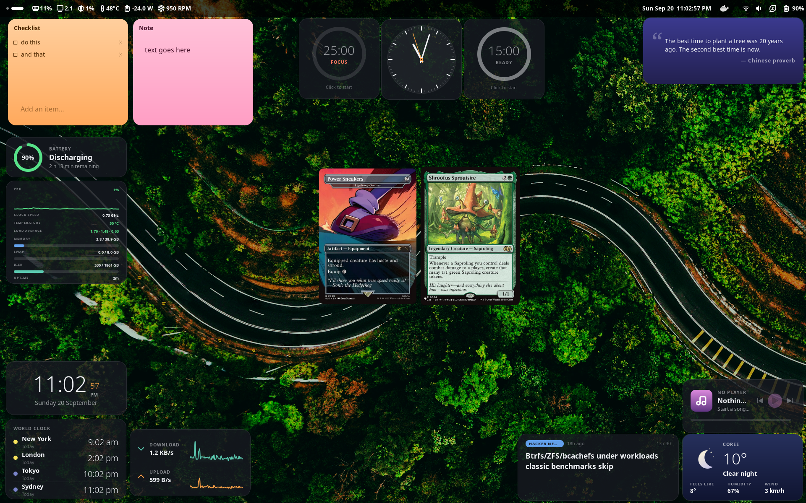

# GNOME Desktop Widgets

A GNOME Shell extension (GNOME 45–50) that puts small scripted widgets on the
desktop, above the wallpaper and below application windows. Widgets are plain
JavaScript files that build St (Shell toolkit) actors.



- [Install and develop](#install-and-develop)
  - [Source layout](#source-layout)
- [Using widgets](#using-widgets)
- [Bundled widgets](#bundled-widgets)
- [Writing a widget](#writing-a-widget)
  - [Folder layout and manifest](#folder-layout-and-manifest)
  - [Script hooks](#script-hooks)
  - [`ctx` — the rendering context](#ctx--the-rendering-context)
  - [`api` — the widget API](#api--the-widget-api)
  - [Moving, dragging and clicking](#moving-dragging-and-clicking)
  - [Look and feel: `ctx.ui`](#look-and-feel-ctxui)
  - [Right-click menu](#right-click-menu)
  - [Keyboard input](#keyboard-input)
  - [Multiple instances](#multiple-instances)
  - [Sandbox, trust and permissions](#sandbox-trust-and-permissions)
  - [Complete example](#complete-example)
- [Files on disk](#files-on-disk)
- [Limitations](#limitations)
- [License](#license)

## Install and develop

```bash
./install.sh --enable      # copy to ~/.local/share/gnome-shell/extensions, compile schemas, enable
./install.sh --system      # install system-wide instead (needs root)
```

- **Widget scripts hot reload.** The shell watches each widget's folder; saving
  `widget.js` re-renders that widget. `install.sh` also refreshes the installed
  copies of the bundled widgets, so editing `default-widgets/*/index.js` and
  running it again is enough.
- **Extension modules do not.** Changes to `extension.js`, `widget-engine.js`,
  `layout-manager.js`, `media.js` and friends need a new shell process: log out and in on
  Wayland, or Alt+F2 → `r` on X11. Changed bundled manifests
  (`default-widgets/*/metadata.json`) are re-installed when
  `DEFAULTS_VERSION` in `default-library.js` is bumped.
- **Logs:** `journalctl --user -b -f | grep -i DesktopWidgets`. Errors thrown by
  a widget's `render`, `update` or `onClick` are logged there and never crash
  the shell.

### Source layout

| File | Role |
|---|---|
| `extension.js` | Entry point: creates the widgets, the layout manager and the right-click menu |
| `widget-engine.js` | Runs one widget: builds `ctx` and `api`, calls the hooks, handles drag and clicks |
| `sandbox.js` | Token check and the small set of globals a script gets |
| `layout-manager.js` | Positions, sizes, snapping and the drag key |
| `store.js`, `importer.js`, `default-library.js` | Registry of widgets, importing folders and archives, installing the bundled widgets |
| `ui-kit.js` | `ctx.ui`: theme, rings, bars, graphs and free drawing |
| `rich-text.js` | `ctx.createRichText`: text with inline images |
| `context-menu.js` | The popup for `api.menu` |
| `media.js` | `api.media`: MPRIS players over D-Bus |
| `network.js` | `api.network`: async requests, the download cache |
| `prefs.js` | The preferences window |
| `default-widgets/<name>/` | The bundled widgets: `metadata.json` (manifest) and `index.js` (script), plus optional `assets/` |

## Using widgets

Open the extension's preferences to enable widgets, import your own (**Import
Folder** or **Import Archive**: `.zip`, `.tar`/`.tgz`), reinstall the bundled ones
(**Install Defaults**), add more copies of widgets that allow it (sticky notes,
MTG cards), and change layout settings.

| Setting | Meaning |
|---|---|
| **Drag Key** | Alt (default), Super, Ctrl or Shift. Hold it and drag anywhere on a widget to move it. Hold it and drag from the bottom-right 16 px corner to resize. |
| Placement Mode | `absolute` or `grid` |
| Snap to Grid / Grid Size | Positions and sizes are rounded to this many pixels when a drag ends (default 32) |

Right-click a widget for its own menu, if it offers one (see
[Right-click menu](#right-click-menu)). Without the drag key, a click goes to the widget itself. A widget can offer
[drag regions](#moving-dragging-and-clicking) that move it with a plain drag.

## Bundled widgets

All are off by default; enable them in preferences. Most have a right-click menu.
The Permissions column is what each widget's manifest asks for (see
[Sandbox](#sandbox-trust-and-permissions)).

| Widget | What it does | Permissions |
|---|---|---|
| Analog Clock | Drawn clock face with a sweeping second hand and minute marks | |
| Digital Clock | Large time with seconds and the date | |
| World Clock | Four cities with a day/night dot. Right-click to choose each city, 24-hour time or open GNOME Clocks | |
| Countdown Timer, Pomodoro Timer | Progress rings. Click to start or pause; right-click for length, restart, reset or skip | |
| Monthly Calendar | Month grid with today highlighted; right-click to change month | |
| Calendar Agenda | Today's agenda (sample events) | |
| Sticky Note | Checklist or free text, in nine colours; add as many as you like. It grows taller as the text gets longer | |
| Quote of the Day | A quote on an indigo card. Right-click for the previous or next quote, or to copy it | |
| RSS News Feed | Headlines from any RSS or Atom feed. Click for the next headline; right-click to set, add or remove feeds | network |
| Weather Summary | Current weather from Open-Meteo with generated icons, located from your IP or a city you pick. Right-click for units | network |
| System Monitor | CPU graph, clock speed, temperature, load, memory, swap, disk and uptime. Right-click to show or hide each; the widget resizes to fit | |
| Battery Status | Charge as a ring, with the state and time remaining | |
| Network Throughput | Live download and upload speed with 60 second graphs | |
| Media Controls | Cover art, title, progress and transport buttons for any MPRIS player | media, network |
| Image Slideshow | Cross-fading pictures from the wallpaper folders. Right-click for timing, pause and captions | |
| Random MTG Card | A random Magic card from Scryfall, or one you choose. Hover for set, prices and legality; click for another; right-click to filter random cards (colour, legendary, type, rarity, format), show art only, or add more copies | network |
| Search Launcher | A search bar that only mimics a launcher | |

## Writing a widget

### Folder layout and manifest

```
my-widget/
  widget.json      # or manifest.json
  widget.js        # the script named by "script"
  assets/          # optional
```

`widget.json`:

```json
{
  "id": "my-widget",
  "display_name": "My Widget",
  "description": "What it does.",
  "type": "text",
  "script": "widget.js",
  "bg_color": "#00000080",
  "text_color": "#ffffff",
  "drag_region": "background",
  "x": 40, "y": 40, "width": 240, "height": 100,
  "permissions": [],
  "enabled": true,
  "version": "1.0",
  "author": "You",
  "tags": ["example"]
}
```

| Field | Required | Meaning |
|---|---|---|
| `id` | yes | Unique id; also the name of the widget's data folder |
| `display_name` | yes | Name shown in preferences |
| `script` | no | Script file, relative to the widget folder. Without it the widget is static (see `text` / `image`) |
| `type` | no | `text` (default) or `image`; only used by script-less widgets |
| `text` | no | Script-less widget: text shown in a wrapping label |
| `image` | no | Script-less `image` widget: a `file://` URI |
| `bg_color` | no | Any CSS colour, e.g. `#ffe066` or `rgba(0,0,0,0.5)` |
| `text_color` | no | Default text colour. Set it when `bg_color` is light — the shell theme's text is near-white |
| `drag_region` | no | `"background"` makes the whole widget draggable without the drag key. Default: none |
| `instances` | no | `{ "add_label": "New Sticky Note" }` gives the widget's page in Preferences a button with that label that adds another copy (see [Multiple instances](#multiple-instances)). Leave it out for a widget that should stay single |
| `layout_revision` | no | Raise it when you change `width`/`height` in an update: existing installs then get the new size once (their position is kept), after which their own resizing wins again |
| `x`, `y`, `width`, `height` | no | Initial geometry in pixels. `x` and `y` are measured from the top-left corner of the **primary monitor**, and the widget is moved in if it would hang off the edge. After the first run the position saved in `layout.json` wins. Saved positions are measured from the primary monitor too, so widgets follow it when the monitors change (dock/undock). A widget that no longer fits on any monitor is shown on the primary one instead, and goes back to its saved spot when the monitor returns |
| `permissions` | no | `"network"`, `"filesystem"` and/or `"media"` (see [Sandbox](#sandbox-trust-and-permissions)) |
| `trusted` | no | Skips the sandbox checks and permissions. See the warning below |
| `enabled` | no | Whether the widget starts enabled (default `true`) |
| `version`, `author`, `tags`, `description` | no | Shown in preferences |

The base look of a widget is a 10 px rounded box with `8px 12px` padding, the
`bg_color` and the `text_color`. `ctx.setStyle()` replaces all of it.

### Script hooks

The script is a plain script (no `import`/`export`). Define any of these
**top-level functions**; the engine picks them up by name. Top-level `var`s are
your widget's in-memory state and live as long as the widget is loaded.

| Hook | Called | Arguments | Notes |
|---|---|---|---|
| `render(ctx, api)` | Once, when the widget starts or its folder changes | `ctx`, `api` | Build actors and add them to `ctx.box`. May **return a function**: it is called as cleanup when the widget stops. |
| `update(ctx, api)` | Every second while the widget is enabled | `ctx`, `api` | Driven by one shared timer. Keep it cheap. For another interval use `api.timer.register`. |
| `onClick(ctx, api)` | A click (press and release without moving) on a plain part of the widget or in a drag region | `ctx`, `api` | Not called for clicks on buttons or entries (they handle their own) or for drag-key presses. |
| `onResize(ctx, api, width, height)` | Whenever the widget's size changes: the user resizing it, its saved layout being applied, `setSize`. Also once after `render` | `ctx`, `api`, size in px | Coalesced to one call per frame. Resize your rings, fonts and images here; `ctx.ui.scale(w, h, designW, designH)` and `ctx.ui.pt(size, scale)` help |
| `onDestroy()` | When the widget stops (disabled, reloaded, removed) | none | Runs after the function returned by `render`. Timers from `api.timer` are cleared automatically afterwards. |

Lifecycle: `render` → (`update` every second, `onClick` on clicks) → cleanup
returned by `render` → `onDestroy`. A hot reload runs all of it again from
`render`. Persisted `api.state` survives; top-level `var`s do not.

### `ctx` — the rendering context

| Member | Description |
|---|---|
| `ctx.box` | The widget's root `St.BoxLayout` (vertical, clips to its size). Add your actors here. |
| `ctx.St`, `ctx.Clutter`, `ctx.Gio`, `ctx.GLib`, `ctx.Pango`, `ctx.GdkPixbuf` | The GObject libraries. `GdkPixbuf.Pixbuf.get_file_info(path)` returns `[format, width, height]` for an image file without loading it |
| `ctx.setStyle(css)` | Replace the root box's inline CSS (background, padding, radius…) |
| `ctx.addClass(name)` / `ctx.removeClass(name)` | Style classes on the root box |
| `ctx.setSize(w, h)` | Resize the widget and save the new size |
| `ctx.ui` | Design tokens plus rings, bars, graphs and free drawing. See [Look and feel](#look-and-feel-ctxui) |
| `ctx.assetPath(name)` | Absolute path of `name` in the widget's `assets/` folder (images, SVGs…), or `null` if the name tries to leave it. Use it with `Gio.FileIcon` or a CSS `url()` |
| `ctx.createRichText(text, options)` | Text with inline images, as an actor to add anywhere: every `{…}` in `text` is replaced by an image, and the rest wraps like a paragraph. See [Text with inline images](#text-with-inline-images) |
| `ctx.setDragRegion(actor, enabled = true)` | Mark `actor` as a region that moves the widget with a plain drag. Makes the actor reactive. Pass `false` to unmark. |

### `api` — the widget API

**`api.system`** — refreshed once a second; `null` until the first reading or when unavailable.

| Call | Returns |
|---|---|
| `api.system.cpu()` | CPU usage, 0–100 |
| `api.system.memory()` | `{ total, free, used, usedPercent }` (`total`/`free`/`used` in kB) |
| `api.system.battery()` | `{ percentage, state, timeToEmpty, timeToFull }` — `state` is the UPower enum (1 charging, 2 discharging, 4 fully charged); times are in seconds. `null` on machines without a battery |

**`api.state`** — small JSON values saved per widget instance in
`widgets/<id>/state.json`, written on every `set`.

| Call | Description |
|---|---|
| `api.state.get(key)` | The stored value, or `undefined` |
| `api.state.set(key, value)` | Store any JSON-serialisable value |

**`api.timer`** — timers that stop when the widget stops.

| Call | Description |
|---|---|
| `api.timer.register(fn, intervalMs)` | Repeat `fn` every `intervalMs`. Returns an id. An exception in `fn` cancels the timer. |
| `api.timer.clear(id)` | Cancel a timer |

**`api.widget`**

| Call | Description |
|---|---|
| `api.widget.setPosition(x, y)` | Move the widget and save it |
| `api.widget.setSize(w, h)` | Resize the widget and save it |
| `api.widget.getLayout()` | `{ x, y, width, height }` |
| `api.widget.log(msg)` | Write to the shell log, prefixed with the widget id |
| `api.widget.notify(title, body)` | Currently only writes to the shell log; no on-screen notification |

**`api.input`** — see [Keyboard input](#keyboard-input).

**`api.instances`** — see [Multiple instances](#multiple-instances). **`api.menu`** — see [Right-click menu](#right-click-menu).

**`api.media`** — needs `"media"` in `permissions`. What is playing in any MPRIS
media player (Spotify, Firefox, Rhythmbox, VLC…), read without blocking. The first
`get()` starts a shared once-a-second poll, which stops when the widget does.

| Call | Returns |
|---|---|
| `api.media.get()` | `{ player, status, title, artist, album, artUrl, length, position, canPrevious, canNext, canPlay }` (`status` is `Playing`, `Paused` or `Stopped`; times in seconds, `position` keeps counting between polls), or `null` when no player is running. The player that is playing wins, else the first found. `artUrl` may be a `file://` or a web address: download the latter with `api.network.download` |
| `api.media.playPause()`, `next()`, `previous()`, `raise()` | Send that command to the player `get()` describes (`raise` brings its window to the front) |

**`api.network`** — needs `"network"` in `permissions`. Otherwise every call throws.

Prefer the non-blocking calls. Every request sets a default `User-Agent`
(`gnome-desktop-widgets/1.0`); pass `headers` to override it or add others (some
APIs, such as Scryfall, insist on their own `User-Agent` and `Accept`). `options`
is `{ method, headers }` and may be left out: `fetchAsync(url, callback)` works.
There is no request body support.

| Call | Callback / returns |
|---|---|
| `api.network.fetchAsync(url, options, callback)` | `callback({ ok, status, body })` — `body` is text, `ok` is true for 2xx, `status` is 0 when the request failed |
| `api.network.fetchJSONAsync(url, options, callback)` | `callback(data, result)` — `data` is the parsed JSON, or `null` on any failure; `result` is as above |
| `api.network.download(url, options, callback)` | Saves the response in the widget's cache folder and calls `callback({ ok, status, path, cached })`. `path` is a local file you can use as an image; the same URL is fetched only once (`cached: true` afterwards) |
| `api.network.fetch(url, options)` | `{ ok, status, body }` **Blocking: freezes the whole desktop until the request finishes** (about a second for a typical API) |
| `api.network.fetchJSON(url, options)` | The parsed JSON or `null`. Blocking, like `fetch` |

Callbacks always run later from the main loop, never inside the call, and never
after the widget has stopped: in-flight requests are cancelled when it is
disabled or reloaded. Cached downloads live in
`~/.cache/gnome-desktop-widgets/<id>/` (all copies of a widget share one folder);
only the 100 most recently used files are kept and a
single download may be at most 20 MB. Show a downloaded image with CSS:

```js
api.network.download(imageUrl, function (res) {
  if (!res.ok) return;
  actor.set_style('background-image: url("' + ctx.GLib.filename_to_uri(res.path, null) + '");');
});
```

**`api.fs`** — needs `"filesystem"` in `permissions`. Paths are relative to the
widget's own data folder (`widgets/<id>/data/`); missing folders are created on write.
Paths are not sanitised, so never pass untrusted input containing `..`.

| Call | Returns |
|---|---|
| `api.fs.readFile(path)` | File contents as text, or `null` |
| `api.fs.writeFile(path, content)` | Nothing; failures are logged |
| `api.fs.exists(path)` | `true` / `false` |

### Moving, dragging and clicking

The rules, in order, for a left-button press on a widget:

1. **Drag key held** → the widget moves (or resizes when the press is in the
   bottom-right 16 px corner), wherever the press landed — even on a button or
   text entry. Nothing is clicked.
2. Otherwise the engine walks up from the actor under the pointer to the
   widget's root box. The **nearest** match wins:
   - a **control** (an actor with `can_focus`, a text entry, anything with a
     `clutter_text`) → the control handles the press itself;
   - a **drag region** (`ctx.setDragRegion`, or `"drag_region": "background"`)
     → a drag begins. Released without moving, it counts as a click and calls
     `onClick`.
3. Anything else → the press passes through untouched, and a click calls `onClick`.

So a button inside a drag region is still a button. A dragged widget is snapped
to the grid and saved to `layout.json` when you let go.

```js
function render(ctx, api) {
  var St = ctx.St;
  var title = new St.Label({ text: 'My widget' });
  ctx.setDragRegion(title);          // drag by the title only
  ctx.box.add_child(title);
  // or: ctx.setDragRegion(ctx.box); // drag by anything that isn't a control
}
```

Non-reactive actors such as `St.Label` are never the target of a press; the
event lands on the nearest reactive parent. `setDragRegion` sets `reactive` on
the actor you give it for that reason.

**Hover.** The engine needs no hook for it: any reactive actor reports the
pointer through St. Set `reactive: true` and `track_hover: true` on an
`St.Widget`, then listen with `actor.connect('notify::hover', ...)` and read
`actor.hover`. Hover works alongside drag regions and clicks. The Random MTG
Card widget uses it to slide its details over the card.

### Text with inline images

`ctx.createRichText(text, options)` returns an actor. Every match of `pattern`
in `text` becomes an image; the words around them are laid out to wrap like a
paragraph, and `\n` starts a new line. Typical use is Magic's mana symbols:

```js
var symbols = { '{T}': '/path/T.svg', '{G}': '/path/G.svg' };   // from api.network.download
var label = ctx.createRichText('{T}: Add {G}.', {
  images: function (token) { return symbols[token] || null; },  // null: show the token as text
  iconSize: 13,
  style: 'font-size: 9pt;',
});
ctx.box.add_child(label);
```

| Option | Default | Meaning |
|---|---|---|
| `images(token)` | required | Local image file for a token such as `{G}` (SVG works), or `null` to show the token itself |
| `pattern` | `/\{[^}]+\}/g` | What counts as a token |
| `iconSize` | `14` | Image size in px |
| `style` | none | CSS for the words |

The actor is built once: to change the text or the images, build a new one.

### Look and feel: `ctx.ui`

The bundled widgets share one look: dark glass cards, light-weight numbers,
small uppercase captions, and the GNOME accent palette. `ctx.ui` is what they
build it from.

```js
function render(ctx, api) {
  var UI = ctx.ui, T = UI.theme;
  ctx.setStyle(T.panel);                                    // the standard card
  ctx.box.add_child(UI.label('CPU', T.caption));            // small uppercase heading
  var ring = UI.ring({ size: 64, thickness: 7, color: T.accent.green });
  ctx.box.add_child(ring);
  ring.setValue(0.42);                                      // 0..1, optional new colour
}
```

| Member | Description |
|---|---|
| `UI.theme` | `text`, `dim`, `faint`, `track`, `hairline` (colours); `accent.blue/green/yellow/orange/red/purple/teal`; `panel` and `paper` (CSS for a dark or a light card, for `ctx.setStyle`); `caption` (CSS for a small heading) |
| `UI.label(text, css, options)` | A label that does not wrap or truncate. `options.wrap: true` lets it wrap (give it `x_expand`); other options are actor properties such as `x_align` |
| `UI.ring({ size, thickness, color, track, value })` | Circular progress. `ring.setValue(fraction, color?)` |
| `UI.bar({ height, color, track, value })` | Horizontal progress bar that fills the width. `bar.setValue(fraction, color?)` |
| `UI.sparkline({ width, height, color, max })` | A smooth line graph with a soft fill. `graph.setValues(array, max?)`; without `max` it scales to the largest value |
| `UI.stack(a, b, …)` | Layers actors on top of each other, each centred (a number inside a ring) |
| `UI.canvas({ width, height, draw })` | Free drawing: `draw(cr, width, height)` gets a Cairo context; call `canvas.redraw()` when the data changes. The analog clock is drawn this way |
| `UI.setColor(cr, css, alpha?)`, `UI.parseColor(css)` | Use CSS colours (`#rrggbb`, `rgba(…)`) with Cairo |
| `UI.scale(w, h, designW, designH)` | How much to scale a design made for `designW × designH` so it fits a widget of `w × h` (the smaller ratio, kept between 0.5 and 4). Use it in `onResize` |
| `UI.pt(size, scale)` | `'font-size: …pt;'` for a design size at that scale |

`ring.resize(size, thickness?)` and `bar.resize(height)` change a ring or bar after it was built.

Tips: St's CSS has no `background-size: cover` or `contain` (they are ignored, and the image is stretched to the widget): give `background-size` and `background-position` in pixels, working the size out with `GdkPixbuf.Pixbuf.get_file_info` (see the Image Slideshow). Avoid `box-shadow` (the widget clips to its own rounded box, which
turns the shadow into square corners), give sizes in multiples of 32 (the default
snap grid) so they survive it, and keep numbers in a light font weight with the unit or
caption in a small, dim one. Icons are `St.Icon` with a symbolic `icon_name`
(`media-playback-start-symbolic`, …) or your own SVGs from `assets/`.

### Right-click menu

`api.menu.set(items)` gives the widget a context menu. Pass an array, or a
function returning one: the function runs on every right click, so labels,
check marks and disabled items can follow the widget's state. With no items
(or none set) a right click does nothing.

```js
api.menu.set(function () {
  return [
    { label: 'Refresh', onSelect: function () { refresh(); } },
    { label: 'Compact', checked: compact, onSelect: function () { toggle(); } },
    { separator: true },
    { label: 'Units', items: [                     // a submenu
      { label: 'Metric', checked: units === 'm', onSelect: function () { setUnits('m'); } },
      { label: 'Imperial', checked: units === 'i', onSelect: function () { setUnits('i'); } },
    ] },
    { label: 'Remove', enabled: api.instances.count() > 1, onSelect: function () { api.instances.remove(); } },
  ];
});
```

| Item field | Meaning |
|---|---|
| `label` | The text |
| `onSelect` | Called after the menu has closed, so it may grab the keyboard, open another window, etc. |
| `checked` | `true` shows a check mark, `false` leaves room for one (a toggle). Leave it out for a plain item |
| `enabled` | `false` greys the item out |
| `visible` | `false` leaves the item out |
| `items` | Makes a submenu of these items; `onSelect` is ignored |
| `separator: true` | A divider line (no label). Doubled and edge separators are dropped |

Right click is always the widget menu, wherever it lands (drag regions and
controls included).

### Keyboard input

Widgets sit below windows, so a text entry only gets keys while the widget
holds a modal grab.

| Call | Description |
|---|---|
| `api.input.grab(focusActor, onRelease)` | Take the keyboard and focus `focusActor`. `onRelease(byUser)` is optional. Returns `true` if the grab was taken. |
| `api.input.release()` | Give the keyboard back |

The grab also ends on **Escape** or a click outside the widget. Typical use:

```js
// Listen on the entry itself, not its clutter_text: for a tall, multi-line
// entry the text is only one line high, and a click below it must still work.
entry.connect('button-press-event', function () {
  api.input.grab(entry);
  return false;                      // let the entry handle the click as well
});
entry.clutter_text.connect('activate', function () { /* Enter pressed */ });
```

Return a cleanup from `render` that calls `api.input.release()` so a reload
never leaves a grab behind.

### Multiple instances

Instances share one script but have their own id, state and position (the
sticky note uses this). A widget can also offer its own "add another" button
on its page in Preferences by declaring `"instances": { "add_label": "…" }`
in its manifest. Preferences has no widget-specific buttons of its own.

| Call | Description |
|---|---|
| `api.instances.create(initialState)` | Add another copy just below and to the right of this one. `initialState` is optional: a plain object the copy's `api.state` starts with (the Random MTG Card widget passes its view and filters). Without it the copy starts blank |
| `api.instances.remove()` | Delete this instance; returns `false` and does nothing if it is the last one. The original is hidden rather than deleted, since it owns the script folder |
| `api.instances.count()` | How many instances are on the desktop |

Changes are applied about 200 ms later, not from inside your click handler.

### Sandbox, trust and permissions

Untrusted scripts are checked for these tokens before running (comments are
ignored); a script containing any of them is refused:

`require` `imports` `global` `process` `eval` `Function` `XMLHttpRequest` `spawn`

Scripts also get a small set of globals: `console.log/warn/error`,
`setTimeout`/`clearTimeout`, `Date`, `Math`, `JSON`, `Number`, `String`,
`Boolean`, `Array`, `Object`, `RegExp`, `Map`, `Set`, `Promise`, `parseInt`,
`parseFloat`, `isNaN`, `isFinite`, `TextDecoder`, `TextEncoder`. Everything else
comes from `ctx` and `api`.

> **This is a filter, not isolation.** Widget code runs inside the GNOME Shell
> process and can reach anything the shell can, and a determined script can
> get around a token check. Only install widgets you trust.
>
> Widgets imported from a folder **under your home directory** are marked
> `trusted` automatically, which skips the token check and grants network and
> filesystem access. The bundled widgets are not trusted.

### Complete example

A clicker with a drag handle, saved state, a timer and a button.

`widget.json`

```json
{
  "id": "clicker",
  "display_name": "Clicker",
  "script": "widget.js",
  "bg_color": "#1e1e2ecc",
  "text_color": "#ffffff",
  "width": 220,
  "height": 100
}
```

`widget.js`

```js
var count = 0;
var label;
var since;

function render(ctx, api) {
  var St = ctx.St;
  count = api.state.get('count') || 0;

  var title = new St.Label({ text: '⠿ Clicker', style: 'font-weight: bold;' });
  ctx.setDragRegion(title);
  ctx.box.add_child(title);

  label = new St.Label({ text: '' });
  ctx.box.add_child(label);

  var btn = new St.Button({ label: 'Add one', can_focus: true });
  btn.connect('clicked', function () {
    count++;
    api.state.set('count', count);
    refresh();
  });
  ctx.box.add_child(btn);

  since = 0;
  api.timer.register(function () { since++; refresh(); }, 5000);
  refresh();

  return function cleanup() { api.widget.log('stopping at ' + count); };
}

function refresh() {
  label.set_text('Count: ' + count + '  (' + since * 5 + 's up)');
}

function update(ctx, api) { /* runs every second; nothing to do here */ }

function onClick(ctx, api) { api.widget.log('background clicked'); }

function onDestroy() { /* last chance to release anything you own */ }
```

## Files on disk

Under `$XDG_DATA_HOME/gnome-desktop-widgets/` (usually `~/.local/share/…`):

| Path | Contents |
|---|---|
| `registry.json` | Every widget's manifest and whether it is enabled |
| `layout.json` | Saved positions and sizes, plus placement mode, snap and grid size |
| `widgets/<id>/` | An imported widget's files |
| `widgets/<id>/state.json` | `api.state` for that instance |
| `widgets/<id>/data/` | `api.fs` root for that instance |
| `default-library/widgets/<id>/` | Installed copies of the bundled widgets (`widget.json` and `widget.js`, made from `metadata.json` and `index.js`) |
| `.default-installed` | The `DEFAULTS_VERSION` last installed |

Under `$XDG_CACHE_HOME/gnome-desktop-widgets/<id>/` (usually `~/.cache/…`):
files saved by `api.network.download`.

The Drag Key is a GSettings key: `dconf`/`gsettings` path
`org.gnome.shell.extensions.gnome-desktop-widgets drag-modifier`
(`alt`, `super`, `ctrl` or `shift`).

## Limitations

- There are no script hooks for drag or focus; only the ones in
  [Script hooks](#script-hooks).
- `update` runs at 1 Hz only. `setTimeout` timers are not cancelled when the
  widget stops; prefer `api.timer`.
- `api.network.fetch` and `fetchJSON` block the shell while they run. Use
  `fetchAsync`, `fetchJSONAsync` and `download` instead.
- Widgets must not depend on state held in top-level `var`s across a reload.
  Use `api.state`.
- The bundled Calendar Agenda shows sample events only, and the Search Launcher
  only mimics a launcher. They are designed and styled as the real thing, so
  they are starting points for real implementations.
- The Weather widget guesses your place from your IP address (ipwho.is) the
  first time it runs; that is often a nearby suburb. Right-click → Set location…

## License

Copyright © 2026 Luke Monaghan. Licensed under the GNU General Public License,
version 2 or (at your option) any later version. See [LICENSE](LICENSE).
Widgets you write for it are your own work and may use any license.
